# Rapid POS ShipStation Connector – Version 2.3
Updated 10/1/2025

---

The Rapid ShipStation connector enables data transfer between Counterpoint and ShipStation, allowing for faster creation of shipping labels. The connector syncs information from **order release tickets** that include a ship-to address, and it can also be used to sync shipping information related to **transfer outs**.

---

## Minimum System Requirements:
- Minimum Counterpoint version: **8.5.6.2**
- Minimum SQL Server version: **2016**

If you would like the ShipStation connector but your system does not meet these minimum requirements, please consult your Care Team Lead (vCIO) for an upgrade quote.

---

## Table of Contents
- [Minimum System Requirements](#minimum-system-requirements)
- [Section 1: Overview of the information sent to ShipStation by the connector](#section-1-overview-of-the-information-sent-to-shipstation-by-the-connector)
- [Section 2: Mapping of specific fields sent to ShipStation for release tickets](#section-2-mapping-of-specific-fields-sent-to-shipstation-for-release-tickets)
- [Section 3: Mapping of specific fields sent to ShipStation for transfer outs](#section-3-mapping-of-specific-fields-sent-to-shipstation-for-transfer-outs)
- [Section 4: Special Note on Country Codes](#section-4-special-note-on-country-codes)
- [Section 5: Tracking information imported by the connector from ShipStation](#section-5-tracking-information-imported-by-the-connector-from-shipstation)
- [Section 6: Configuration](#section-6-configuration)
- [Section 7: Configuration Ship-Via Codes](#section-7-configuration-ship-via-codes)
- [Section 8: ShipStation Carriers Table](#section-8-shipstation-carriers-table)
- [Conclusion](#conclusion)

---

## SECTION 1: Overview of the information sent to ShipStation by the connector

The connector sends two specific types of documents from Counterpoint to ShipStation: **order release tickets** with a ship-to address, and **posted transfer outs** with a ship-via code (with limited details).

### Order Release Tickets

- When an order (or part of an order) is released in Counterpoint, a release ticket is created.  
- Only order release tickets that contain a ship-to address are sent to ShipStation.  
- Orders and regular tickets are not sent to ShipStation.  
- **Ship-via codes** are used to determine which release tickets should be sent and which should be excluded.  
  - Note: If the ship-via code is left blank, the release ticket will be pushed up to ShipStation.

### Posted Transfer Outs (Optional)

- If enabled, the connector can also send posted transfer outs, though with significantly limited information compared to release tickets.  
- The transfer out functionality in Counterpoint is primarily used by clients who operate multiple inventory locations and need to move inventory from one location to another.  
- **Ship-via codes** are again used to identify which posted transfers should be sent to ShipStation and which should be excluded.
  - Note: If the ship-via code is left blank, the transfer will not be sent. This ensures that only transfers requiring a shipping label (those not moved directly between locations) are sent to ShipStation.

### Data Flow to ShipStation

The connector uses a **Windows Service** to continuously push information to ShipStation:  

- Order release tickets are sent to ShipStation as soon as the release ticket is completed in Counterpoint.  
- Transfer outs are sent to ShipStation as soon as they are posted in Counterpoint.  
- In most cases, both release tickets and transfer outs appear in ShipStation in less than 30 seconds (unless there is a backlog or a connectivity issue that causes delays).  

---

## SECTION 2: Mapping of specific fields sent to ShipStation for release tickets

Note: ShipStation Fields marked with a * may not be visible in the user interface in ShipStation. The data is sent to ShipStation and is only visible to a programmer querying the ShipStation APIs.  

### Release Ticket Header Fields

| Counterpoint Field | ShipStation Field |
|---------------------|-------------------|
| [*CI/CD Configurable*] Original Order Number or Release Ticket Number | Order Number |
| Document Identifier (of the specific release ticket) | Order Key* |
| Ticket Date/Time (of the specific release ticket) | Order Date |
| Payment Date (date of last payment if multiple) | Paid Date |
| Ship Date | Ship By Date |
| Hard coded to '*Awaiting Shipment*' | Order Status |
| [*Configurable, T&M, mapped*] Ship-From Location (Stocking Location ID) | Warehouse ID |
| Ticket Profile Alpha 3 (can be populated with ship-via code or other header field) | Shipping Service |
| Total | Total Paid (in $) |
| Tax Total | Tax Paid (in $) |
| Misc Charge Total | Shipping Paid (in $) |
| Customer Number | Sold To Customer ID* |
| Billing Email Address 1 | Sold To Customer Email |
| Billing Name | Sold To Name |
| Billing Address 1 | Sold To Street1 |
| Billing Address 2 | Sold To Street2 |
| Billing Address 3 | Sold To Street3 |
| Billing City | Sold To City |
| Billing State | Sold To State |
| Billing Zip Code | Sold To Postal Code |
| Billing Country – [Required ISO code](https://www.shipstation.com/docs/api/models/address/) | Sold To Country |
| Billing Phone 1 | Sold To Phone |
| Shipping Name | Ship To Name |
| Shipping Address 1 | Ship To Street 1 |
| Shipping Address 2 | Ship To Street 2 |
| Shipping Address 3 | Ship To Street 3 |
| Shipping City | Ship To City |
| Shipping State | Ship To State |
| Shipping Zip Code | Ship To Postal Code |
| Shipping Country – [Required ISO code](https://www.shipstation.com/docs/api/models/address/) | Ship To Country |
| Shipping Phone 1 | Ship To Phone |

### Release Ticket Line Fields

| Counterpoint Label | ShipStation Field |
|---------------------|-------------------|
| Line Sequence Number | Line Item Key* |
| Item Number | Item SKU |
| Item Description | Item Name |
| [*Configurable*] Item’s Unit Weight | Item Weight |
| Quantity Sold | Item Quantity |
| Price | Item Unit Cost |
| Tax Amount (allocated) | Item Unit Tax* |
| Bin 1, Bin 2, Bin 3, Bin 4 values of all the items on the order concatenated with a pipe delimiter | Item Warehouse Location* |

Note: In ShipStation, the order line will appear with a line total. This line total is calculated by ShipStation using the quantity and unit cost. The connector does not push a line total value directly.  

---

## SECTION 3: Mapping of specific fields sent to ShipStation for transfer outs

Note: ShipStation Fields marked with a * may not be visible in the user interface in ShipStation. The data is sent to ShipStation and is only visible to a programmer querying the ShipStation APIs.  

### Transfer Out Header Fields

| Counterpoint Field | ShipStation Field |
|---------------------|-------------------|
| **`Transfer Out #`** | **`Order Number`** |
| **`Document Identifier (of the specific release ticket)`** | **`Order Key*`** |
| **`Transfer Out Posting Date/Time`** | **`Order Date`** |
| **`Payment Date (date of last payment if multiple)`** | **`Paid Date`** |
| **`Ship Date`** | **`Ship By Date`** |
| Hard coded to 'Awaiting Shipment' | **`Order Status`** |
| **`Customer #`** | **`Sold To Customer ID*`** |
| **`Billing Email Address 1`** | **`Sold To Customer Email`** |
| **`Total`** | **`Total Paid (in $)`** |
| **`Tax Total`** | **`Tax Paid (in $)`** |
| **`Misc Charge Total`** | **`Shipping Paid (in $)`** |
| **`Ship-via code (on transfer out custom tab)`** | **`Shipping Service`** |
| **`Billing Name`** | **`Sold To Name`** |
| **`Billing Address 1`** | **`Sold To Street1`** |
| **`Billing Address 2`** | **`Sold To Street2`** |
| **`Billing Address 3`** | **`Sold To Street3`** |
| **`Billing City`** | **`Sold To City`** |
| **`Billing State`** | **`Sold To State`** |
| **`Billing Zip Code`** | **`Sold To Postal Code`** |
| **`Billing Country – Required ISO code`** | **`Sold To Country`** |
| **`Billing Phone 1`** | **`Sold To Phone`** |
| **`“Transfer To” Location Description`** | **`Ship To Name`** |
| **`“Transfer To” Location Address 1`** | **`Ship To Street 1`** |
| **`“Transfer To” Location Address 2`** | **`Ship To Street 2`** |
| **`“Transfer To” Location Address 3`** | **`Ship To Street 3`** |
| **`“Transfer To” Location City`** | **`Ship To City`** |
| **`“Transfer To” Location State`** | **`Ship To State`** |
| **`“Transfer To” Location Zip Code`** | **`Ship To Postal Code`** |
| **`“Transfer To” Location Country – Required ISO code`** | **`Ship To Country`** |
| **`“Transfer To” Location Phone 1`** | **`Ship To Phone`** |
| **`[Configurable, T&M, mapped] Ship-From Location (Stocking Loc ID)`** | **`Warehouse ID`** |

### Transfer Out Line Fields
Note: No line data is currently pushed for transfer outs.  

---

## SECTION 4: Special Note on Country Codes

ShipStation requires all country codes in both ship-to addresses and location addresses to be formatted as valid two-letter ISO country codes.  

You can review the current ISO country code list in ShipStation’s documentation:  
[ShipStation Address Model – Country Codes](https://www.shipstation.com/docs/api/models/address/)  

- If the country field in Counterpoint is left blank, or if the value contains dashes, the connector will automatically default the country to US.
- If the country field in Counterpoint is populated with anything other than a valid two-letter ISO code, the record (release ticket or transfer out) will encounter an error and will not be sent to ShipStation.
- Be careful to use two-letter abbreviations such as **US** and **CA**. Do **not** use three-letter codes such as **USA** or **CAN**, as these will cause the record to be rejected.

---

## SECTION 5: Tracking information imported by the connector from ShipStation

Three pieces of information are imported from ShipStation back into Counterpoint:

| ShipStation Field | Counterpoint Field |
|-------------------|---------------------|
| ShipStation ID | ShipStation ID (USER_SHIP_STATION_ID) |
| Tracking Number(s) | Tracking Number (additional tab on ticket) |
| Carrier Code | Ship-Via Code (if mapped to the carrier code) |

When an order release ticket or a posted transfer out is received by ShipStation, the ShipStation ID is immediately returned to Counterpoint and saved to the release ticket header or the posted transfer out header.  

A background task runs on a scheduled interval (default is every 15 minutes, but this can be configured) to call ShipStation and retrieve tracking numbers and their associated carrier codes. 
- Multiple tracking numbers may be associated with a single release ticket.
- One tracking number may be associated with a transfer out.  

For release tickets, the retrieved tracking information is written directly to the release ticket itself. If/when the release ticket is posted, the same information is also copied into both the related ticket history and order history records, ensuring that tracking details remain accessible after posting.

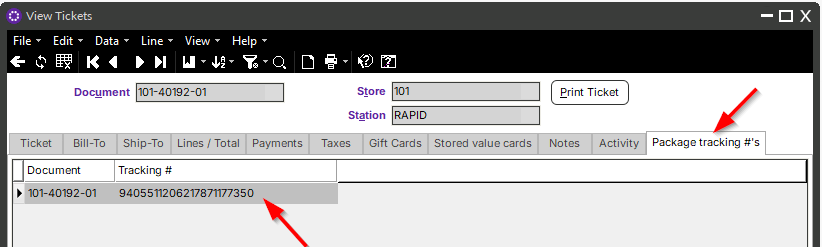

For posted transfer outs, the tracking information is updated as well, but it is only visible in the posted transfer out lookup, which can be accessed by clicking “Select Transfer” on the Transfer In screen.  

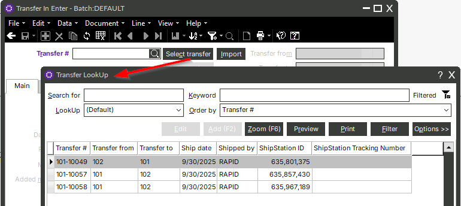

---

## SECTION 6: Configuration

The connector includes several configuration options that control how it interacts with ShipStation and Counterpoint. These settings should be reviewed carefully during setup and adjusted only when necessary.

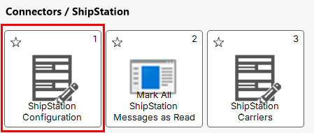

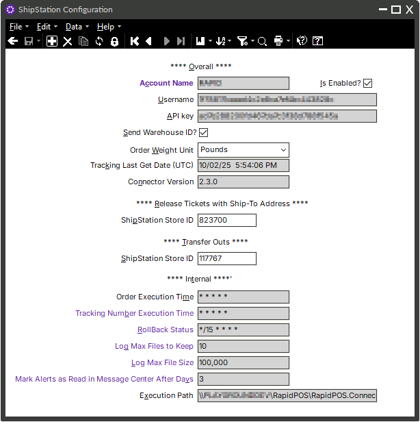

**Account Name, Username, and API Key**  
These fields identify the ShipStation account and provide the authentication credentials needed for the connector to communicate with ShipStation.

**Is Enabled?**  
This option allows the connector to be paused during troubleshooting, stopping data flow without needing to stop the Windows Service.

**Send Warehouse ID?**  
For clients with multiple inventory locations in Counterpoint, ShipStation can be configured with multiple “Ship From” locations. Each Ship From location is assigned a ShipStation Warehouse ID (retrievable only via API). 

This configuration option allows you to assign the ShipStation Warehouse ID value to the corresponding location in Counterpoint. When documents are pushed from Counterpoint to ShipStation, the correct Ship From location will be set automatically.

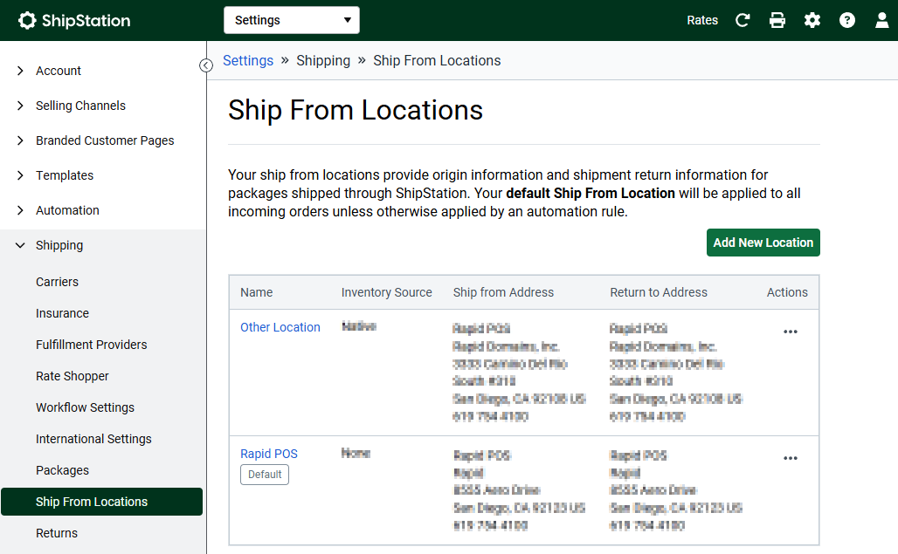

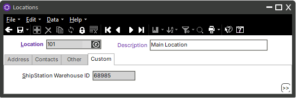

**Order Weight Unit**  
The weight field on an item record in Counterpoint stores only a numeric value; it does not specify the unit of measure. The connector requires all item weights to use a single, consistent unit of measure: pounds, ounces, or grams. Set this option to match the unit used across all item records in Counterpoint. 
 - If all items' weights are entered as pounds, select pounds. 
 - If all are in ounces or grams, select the matching unit. 
 - If items are stored in mixed units, you must standardize them to a single unit before integration. 
- The setting applies globally and must remain consistent across all item records in Counterpoint. 
- When weights are sent to ShipStation, the numerical value and configured unit of measure are converted into ShipStation’s format, expressed in pounds and ounces (for example, 1.5 lb becomes 1 lb 8 oz). 

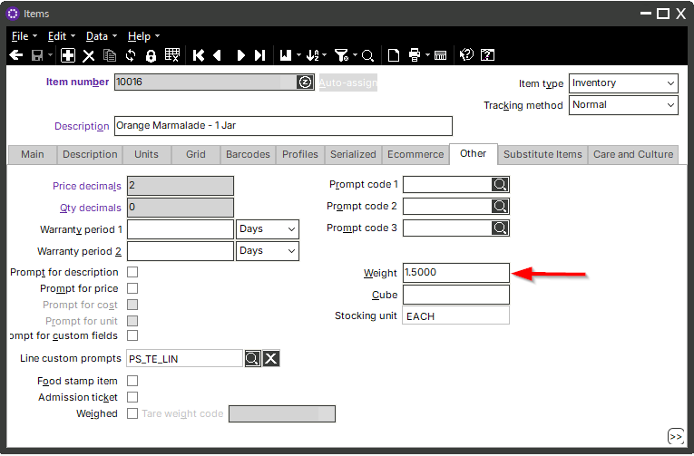

**Tracking Last Get Date (UTC)**  
Release tickets and transfer outs are pushed to ShipStation immediately, but tracking information is imported on a schedule (typically every 15 minutes). This field displays the last time tracking information was imported, shown in Coordinated Universal Time (UTC).

**Connector Version**  
This field is automatically updated each time the connector is upgraded. It is provided for reference only and does not require configuration.

**Release Tickets ShipStation Store ID and Transfer Outs ShipStation Store ID**  
ShipStation supports multiple “stores” within its user interface. These stores are unrelated to stores in Counterpoint. Instead, they are used to organize shipments—often by platform, such as POS, ecommerce, or marketplace. 

Each ShipStation store has a Store ID value (retrievable only via API). This configuration allows you to assign a ShipStation Store ID so that release tickets and transfer outs are pushed to a specific ShipStation store. Many clients will use only a single ShipStation store, but the option is available for more complex setups.

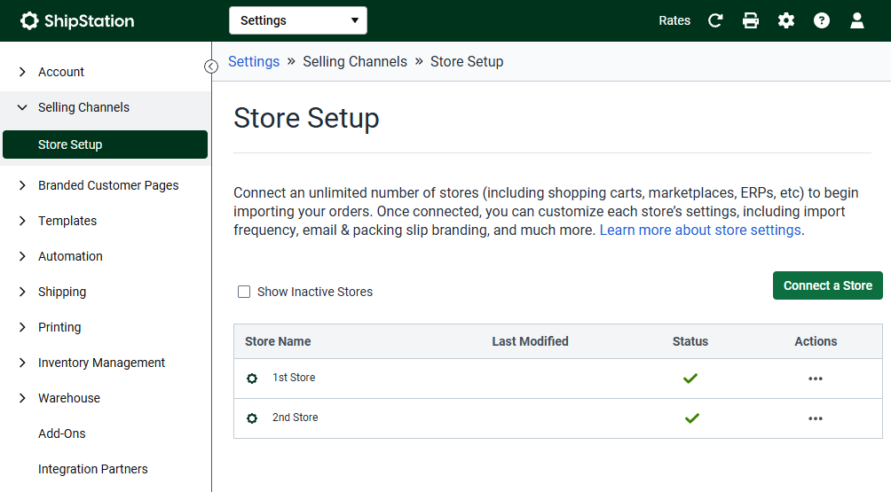

**Internal Configuration Options**  
Additional internal configuration options exist within the connector. These are primarily used by programmers to optimize performance or to assist in troubleshooting. These values should not be adjusted by end users.

---

## SECTION 7: Configuration Ship-Via Codes

When the ShipStation connector is installed, additional fields are added to the Ship-Via Codes table in Counterpoint. These fields define which ship-via codes can be assigned to customers (for release tickets) and to transfer outs. Each ship-via code can also be flagged to either send or not send to ShipStation.  

For example, ship-via codes such as "store pickup" or "delivery" usually do not require shipping labels and do not need to be pushed to ShipStation. In contrast, ship-via codes representing specific carriers or shipping methods (such as "overnight shipping") should be sent to ShipStation.  

These send/do-not-send flags must be configured after the connector is installed. 

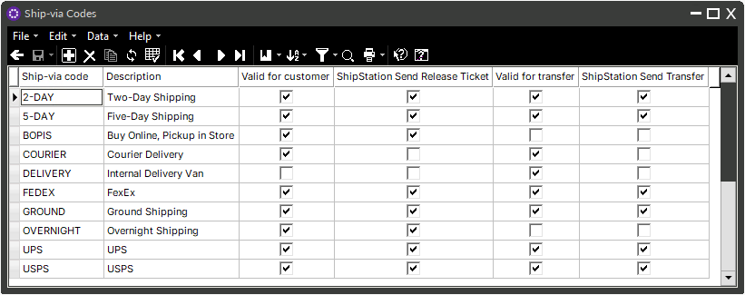

Once configured, a ship-via code can then be assigned on the ship-to address screen or on the custom tab of the transfer out screen.

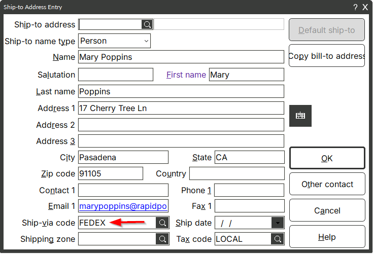

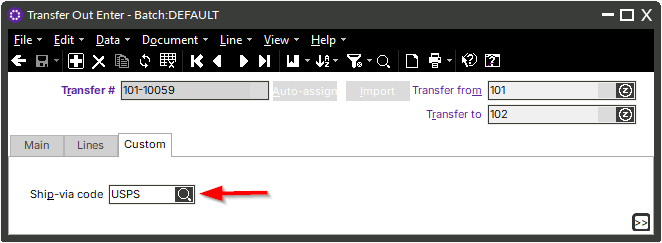

### Ship-Via Code Processing Rules

- **Order Release Tickets**  
  - Default: Pushed to ShipStation if a ship-to address is present, even if no ship-via code is assigned.  
  - Exception: Not pushed if a ship-via code is selected that is configured as "Do Not Send."  

- **Transfer Outs**  
  - Default: Only pushed to ShipStation when a ship-via code is present and configured as "Send."  
  - Otherwise: Not pushed if the ship-via code is blank or configured as "Do Not Send."  

**Quick Reference: Ship-Via Code Logic**

| Document Type        | Ship-Via Code Blank                 | Ship-Via Code = Send | Ship-Via Code = Do Not Send |
|----------------------|-------------------------------------|----------------------|-----------------------------|
| Order Release Ticket | Sent (if ship-to address present)   | Sent                 | Not Sent                    |
| Transfer Out         | Not Sent                            | Sent                 | Not Sent                    |

---

## SECTION 8: ShipStation Carriers Table

The Carriers Table logic applies only to tracking numbers imported back into Counterpoint for release tickets. It does not currently apply to transfer outs (for transfer outs, only the tracking number is imported, not the carrier).  

The ShipStation Carriers Table in Counterpoint is used to map carrier information from ShipStation. When tracking numbers are imported, the associated carrier is also recorded in Counterpoint so that release tickets and their associated ticket history reflect the correct shipping provider.  

In Counterpoint, the ship-via code on orders and release tickets may be populated and passed to ShipStation to guide shipping service selection. Alternatively, the ship-via code may be left blank, in which case the service is chosen in ShipStation. Once finalized in ShipStation, the assigned carrier code for release tickets is returned to Counterpoint along with tracking numbers.  

**Default behavior:** When a new carrier is added in ShipStation, a corresponding entry is automatically created in the Carriers Table in Counterpoint. The ShipStation Provider ID, Carrier Code, and Carrier Name are populated, while the Counterpoint ship-via code remains blank.  

**When ship-via code is blank:** If the ship-via code field in the Carriers Table remains blank, the existing ship-via code already assigned in Counterpoint is retained whenever that carrier code is used. The value is not updated or overwritten.  

**When ship-via code is populated:** If a ship-via code is manually entered in the Carriers Table, the Counterpoint ship-via code is updated each time the associated carrier is used in ShipStation and tracking data is imported. This ensures that imported tracking numbers apply both the carrier information and the designated ship-via code in Counterpoint.  

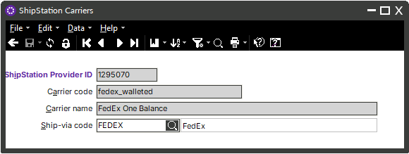

For best results, review the Carriers Table periodically and ensure that ship-via codes are populated where appropriate.  

**Quick Reference: Carriers Table Logic**

| Carriers Table Ship-Via Code | Behavior in Counterpoint when carrier is used in ShipStation |
|------------------------------|--------------------------------------------------------------|
| Blank                        | Existing ship-via code on the release ticket is retained. No update occurs. |
| Populated                    | Ship-via code on the release ticket is updated with the value populated for the carrier associated with the imported tracking number. |

---

## Conclusion

Rapid's Counterpoint to ShipStation connector streamlines the exchange of orders, transfers, and tracking information between the two systems, reducing manual entry and ensuring shipments move efficiently.  

When setting up the connector for the first time, review each configuration section carefully, with special attention to order weight units, ship-via code rules, and the carriers table. If you need help configuring ShipStation warehouse IDs or store IDs, or if you have other questions about setup, troubleshooting, or advanced options, please reach out to support.  

---
